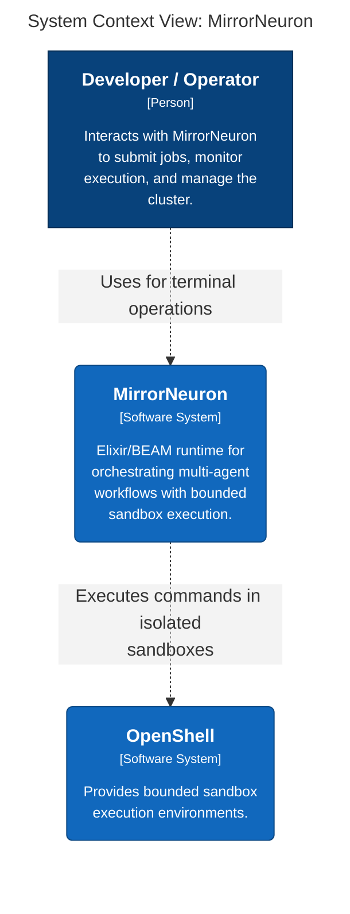
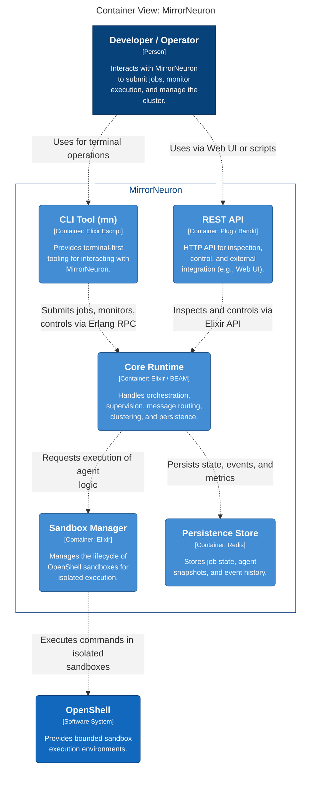
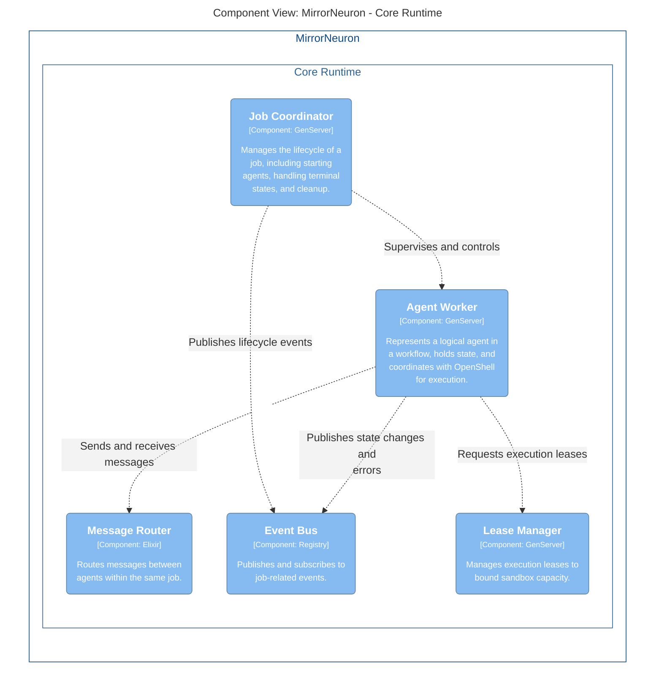
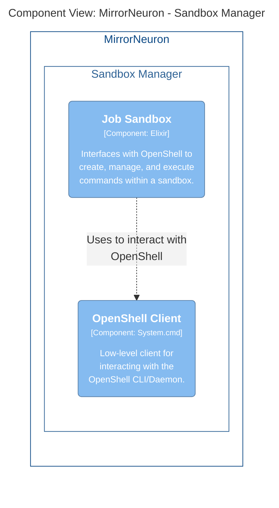

# MirrorNeuron Architecture

MirrorNeuron is designed as an Elixir/BEAM runtime for orchestrating multi-agent workflows with bounded sandbox execution. Currently, the `mn` CLI and the HTTP API act as two shells interfacing directly with the internal core components.

In the future, introducing a unified SDK layer would abstract these internal interfaces, allowing both the CLI and the Web API to consume the same stable public boundary.

## System Context

The overall system architecture involves the Developer/Operator interacting with MirrorNeuron, which in turn manages execution via OpenShell.

## Containers

Zooming in, we see the main components that make up MirrorNeuron:
*   **CLI Tool (mn)**: Terminal-first interface.
*   **REST API**: HTTP API.
*   **Core Runtime**: Built on Elixir/BEAM, handles orchestration and state.
*   **Sandbox Manager**: Handles OpenShell interaction.
*   **Persistence Store**: Redis for state.

## Core Runtime Components

The core logic within the BEAM node relies on several GenServers and internal modules to route messages and coordinate jobs.

## Sandbox Manager Components

The component that bridges Elixir space to the external OpenShell environments.

