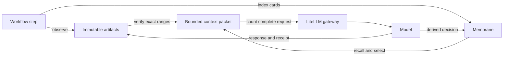

# Context Memory And Compression

- **Reader:** blueprint authors, runtime integrators, and operators
- **Outcome:** design and operate model turns whose context remains bounded over
  long-running jobs
- **Page type:** architecture and operational guide
- **Scope:** Membrane `mn.context.working.v1`, SDK `ContextSession`, and gateway
  admission
- **Maturity:** implemented
- **Sources of truth:** Membrane `context.proto` and `src/working/`; Python SDK
  `mn_sdk/context_session/`, `litellm_context.py`, and their tests
- **Validation:** Membrane Rust tests; Python SDK context-session,
  LiteLLM-context, model-context-capacity, and submission-preparation tests

MirrorNeuron uses the Membrane projects for shared working memory, context
selection, context compression, and benchmark evaluation.

This page is for blueprint authors and runtime operators. It explains how to
keep long-running jobs useful when their accumulated evidence is larger than
any model context window. The behavior described here is implemented by
Membrane's `mn.context.working.v1` contract and the Python SDK
`ContextSession`; legacy context APIs remain available.

## The bounded-context model

Treat a model's context as a cache, not as the job record. The durable record
contains immutable source artifacts, observations, decisions, obligations, and
receipts. Before each model decision, the runtime constructs a fresh bounded
working set containing the most important exact facts for that decision.



Larger hardware and model windows allow a larger cache. They do not change the
design: history can grow without bound, while every model request remains
bounded.

## Ownership

| Component | Responsibility |
| --- | --- |
| Workflow/Core | Run identity, cancellation, deadlines, and splitting work after `needs_partition` |
| Python SDK `ContextSession` | Immutable artifact journal, complete-request token counting, budgets, exact-source verification, dispatch and response receipts |
| Membrane `WorkingMemory` | Run-scoped indexed recall, ACLs, supersession, obligations, deterministic bounded selection |
| LiteLLM/model gateway | Provider tokenizer, final context admission, and model execution |

Context selection does not call tools, redesign a workflow, or generate new
evidence. It selects and verifies existing records. A dynamic planner may use
the result of a completed decision to plan the next workflow round, but the
memory layer does not change the executing DAG.

## One model-turn lifecycle

1. Record new tool results and evidence as immutable artifacts. Index bounded
   cards with topics, source references, kind, validation, and relationships.
2. Declare the decision focus, required fields, required evidence references,
   and relevant topics.
3. Membrane recalls relevant records and independently allocates space for
   supporting and opposing evidence.
4. Membrane returns whole, bounded representations plus coverage and a
   continuation cursor. Required records remain exact.
5. The SDK verifies every selected source range against its frozen artifact and
   assembles the full request, including instructions, schemas, framing, current
   input, and output reserve.
6. The SDK counts the complete request with the provider-compatible tokenizer.
   If needed, it requests a smaller packet and recounts.
7. The SDK persists dispatch state before the model call, then stores the model
   response and an idempotent completion receipt.

The admission equation is:

```text
input_budget = window_tokens - output_reserve - safety_tokens
```

The SDK defaults are a 16,384-token window, 2,048 output tokens, a 512-token
safety reserve, a 70 percent packet target, and a 20 percent counter-evidence
share of optional evidence. They are policy defaults rather than a declaration
of model capacity. Runtime model preparation may configure a larger supported
window; every request still passes through bounded selection and final token
admission.

## What remains exact

The runtime may evict optional or stale representations, but it does not
silently drop current decision requirements. Protected inputs include:

- system and developer instructions;
- current user input and fields marked required;
- required evidence references and unresolved obligations;
- constraints, quotations, paths, URLs, dates, and identifiers;
- source provenance and validation state;
- relevant contradictions and counter-evidence.

Generated summaries are derived navigation aids, not citable evidence. A
finding must resolve back to immutable source bytes. Coverage metadata records
what was considered and whether more relevant records remain.

## Cache misses and work partitioning

An agent may issue bounded `recall_memory` and `read_memory` actions to retrieve
another page or an exact source range. These actions only read memory; they do
not dispatch domain tools or modify workflow topology.

If required instructions, schemas, current input, or evidence cannot fit,
`ContextSession` raises `NeedsPartition`. The workflow owner should split the
decision into smaller independently reviewable calls and carry their verified
results forward. Increasing the window is an optional capacity improvement,
not the recovery contract. Silently truncating required evidence is invalid.

## Long-running jobs and recovery

- Recall is paginated and count-limited before allocation.
- Artifact reads and selected cards have hard byte bounds.
- Continuation cursors rotate coverage through relevant cold records.
- New observations may supersede stale cards without rewriting original files.
- Run-wide storage, deadline, and model-call budgets fail explicitly.
- `final_call_reserve` can protect synthesis capacity from investigation calls.
- Cancellation is checked around memory operations and model dispatch.

Events use stable idempotency keys and fingerprints. Identical completed events
replay their stored result; the same identity with different content fails.
Memory compiles use revision fencing so a packet cannot mix records from before
and after a concurrent update.

A model call is recorded as dispatched before network execution. If recovery
cannot prove whether that call completed, it raises `AmbiguousInvocation`
instead of repeating a possibly billable call. A durable response is replayed
and its writeback is completed idempotently.

## Failure behavior

| Condition | Result |
| --- | --- |
| Required input is too large | `needs_partition`; split the decision |
| Context storage, call, or deadline budget is reached | Explicit budget failure or workflow-defined incomplete result |
| Source hash or range does not match | Fail without using the evidence |
| Revision or idempotency identity is stale/conflicting | Reject the write |
| Prior model dispatch has no durable response | `AmbiguousInvocation`; use an explicit retry identity |
| Optional model selector fails | Deterministic selection continues |
| Membrane or the provider is unavailable | Dependency failure; do not fabricate a result |

## Security and privacy

Deploy `WorkingMemory` on the trusted runtime service network. Operators may
set `MN_CONTEXT_AUTH_TOKEN` for bearer protection. The SDK binds job, run, and
principal identity outside model-controlled arguments. Membrane applies ACLs
before returning cards or artifact handles, and source reads recheck the handle.

Source text stays in artifact storage. Logs and public progress should expose
bounded metadata, hashes, counts, and identifiers rather than confidential
prompt inputs.

## Components

| Folder | Purpose | Main validation |
| --- | --- | --- |
| [`Membrane/mn-context-engine`](../Membrane/mn-context-engine) | Rust gRPC context engine. | `cargo test` |
| [`Membrane/mn-context-engine-python-sdk`](../Membrane/mn-context-engine-python-sdk/README.md) | Python SDK shell and utilities for the Rust engine. | `.venv/bin/python -m pytest -q` |
| [`Membrane/mn-context-auto-optimizer`](../Membrane/mn-context-auto-optimizer/README.md) | Deterministic graph/NLP context compression and optional model tooling. | `.venv/bin/python -m pytest -q` |
| [`Membrane/mn-context-auto-optimizer-benchmark`](../Membrane/mn-context-auto-optimizer-benchmark/README.md) | Benchmark and telemetry package for context compression models. | `.venv/bin/python -m pytest -q` |

## Python SDK

Install the Membrane Python SDK from source:

```bash
cd Membrane/mn-context-engine-python-sdk
.venv/bin/python -m pip install -e ".[dev]"
.venv/bin/python -m pytest -q
```

Optional extras are package-specific:

```bash
.venv/bin/python -m pip install -e ".[compression]"
.venv/bin/python -m pip install -e ".[qdrant]"
```

Use `qdrant` and `qdrant-gpu` in separate environments because their FastEmbed
dependencies are mutually exclusive.

## Optimizer Runtime

Install the deterministic optimizer:

```bash
cd Membrane/mn-context-auto-optimizer
.venv/bin/python -m pip install -e ".[dev]"
.venv/bin/python -m pytest -q
```

Inspect runtime capabilities:

```bash
mn-context-packer runtime-info
```

Compress a context packet from standard input:

```bash
cat packet.json | mn-context-packer compress \
  --compression-mode graph_nlp \
  --target-tokens 800 \
  --focus-id goal_1 \
  --agent-role executor
```

Supported compression modes:

| Mode | Use |
| --- | --- |
| `graph_nlp` | Deterministic graph and NLP compression with no model dependency. |
| `llm_only` | Model-only compression; requires `--model-dir` or `MN_CONTEXT_MODEL_DIR`. |
| `hybrid` | Graph-first deterministic compression with optional evidence-only rewrite. |

## Benchmarks

Install the benchmark package:

```bash
cd Membrane/mn-context-auto-optimizer-benchmark
.venv/bin/python -m pip install -e ".[dev]"
```

Run the default graph benchmark:

```bash
mn-context-benchmark --config configs/default.yaml
```

Build a blueprint-derived benchmark suite from the local catalog:

```bash
mn-context-build-blueprint-suite \
  --blueprint-root ../../otterdesk-blueprints \
  --packet-output artifacts/data/blueprint_packet_results.json \
  --working-memory-output artifacts/data/blueprint_working_memory_cases.json \
  --coverage-output artifacts/data/blueprint_suite_coverage.json \
  --cases-per-manifest 12
```

## Notes

- The deterministic runtime path should preserve goals, constraints, source
  references, failures, recovery state, and next actions.
- Optional model or GPU dependencies should be installed only for the benchmark
  or compression path that needs them.
- Keep private or role-restricted memory out of shared context packets unless
  the caller explicitly has access.
- Validate complete provider requests with the provider tokenizer; byte budgets
  are deterministic selection guides, not token guarantees.
- Preserve supporting and opposing evidence independently so a dominant
  hypothesis cannot hide known contradictions.

## Related Pages

- [Runtime Architecture](runtime-architecture.md)
- [Model Runtime](model-runtime.md)
- [Component Guide](component-guide.md)
- [Security Model](security.md)
- [Membrane bounded-context design](../Membrane/docs/bounded-context.md)
